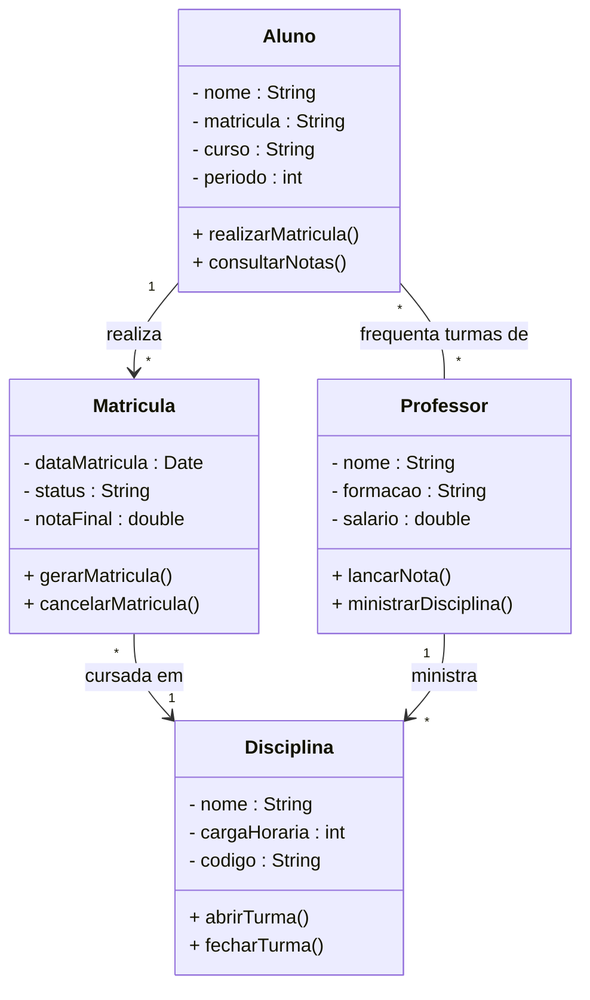

# 📐 Atividade Avaliativa 2PA — Diagrama de Classes

<div align="center">


</div>

---

## 📋 Informações da Atividade

| Campo | Detalhes |
|---|---|
| 🎓 **Aluna** | Thayná Batista da Silva |
| 📚 **Curso** | Análise e Desenvolvimento de Sistemas |
| 🏫 **Instituição** | Faculdade Senac Recife-PE |
| 📖 **Unidade Curricular** | Engenharia de Requisitos — 2026.1 |
| 📝 **Atividade** | Atividade Avaliativa 2PA — Diagrama de Classes |
| 📅 **Prazo de Entrega** | 31 de maio de 2026 às 23:59 |

---

## 🎯 Objetivo

Desenvolver um **Diagrama de Classes UML** para representar o funcionamento de um sistema acadêmico de uma instituição de ensino, contemplando o gerenciamento de alunos, professores, disciplinas e matrículas.

---

## ⚙️ Funcionalidades do Sistema

- ✅ Cadastro de alunos
- ✅ Cadastro de professores
- ✅ Cadastro de disciplinas
- ✅ Realização de matrículas
- ✅ Controle das notas dos alunos
- ✅ Associação de professores às disciplinas

---

## 🗂️ Classes do Sistema

### 👤 Aluno

| Visibilidade | Atributo / Método | Tipo |
|:---:|---|---|
| `–` | `nome` | String |
| `–` | `matricula` | String |
| `–` | `curso` | String |
| `–` | `periodo` | int |
| `+` | `realizarMatricula()` | void |
| `+` | `consultarNotas()` | void |

---

### 👨‍🏫 Professor

| Visibilidade | Atributo / Método | Tipo |
|:---:|---|---|
| `–` | `nome` | String |
| `–` | `formacao` | String |
| `–` | `salario` | double |
| `+` | `lancarNota()` | void |
| `+` | `ministrarDisciplina()` | void |

---

### 📚 Disciplina

| Visibilidade | Atributo / Método | Tipo |
|:---:|---|---|
| `–` | `nome` | String |
| `–` | `cargaHoraria` | int |
| `–` | `codigo` | String |
| `+` | `abrirTurma()` | void |
| `+` | `fecharTurma()` | void |

---

### 📝 Matrícula

| Visibilidade | Atributo / Método | Tipo |
|:---:|---|---|
| `–` | `dataMatricula` | Date |
| `–` | `status` | String |
| `–` | `notaFinal` | double |
| `+` | `gerarMatricula()` | void |
| `+` | `cancelarMatricula()` | void |

---

## 🔗 Relacionamentos

```
Aluno          ──────────────── Matrícula
               1              *
               (um aluno realiza várias matrículas)

Matrícula      ──────────────── Disciplina
               *              1
               (cada matrícula pertence a uma disciplina)

Professor      ──────────────── Disciplina
               1              *
               (um professor ministra várias disciplinas)

Aluno          ──────────────── Professor
               *              *
               (vários alunos frequentam turmas de vários professores)
```

---

## 📐 Diagrama de Classes UML



---

## 📏 Regras de Negócio

> 📌 **Regra 1** — Uma disciplina pode ter vários alunos matriculados.

> 📌 **Regra 2** — Um professor pode ministrar mais de uma disciplina.

> 📌 **Regra 3** — Cada matrícula pertence a apenas um aluno.

---

## 🛠️ Tecnologias e Ferramentas


---

## 📞 Contato

<div align="center">

  <a href="https://br.linkedin.com/in/thaynabds" target="_blank">
    
  </a>
  
  <a href="https://www.instagram.com/thaynabdstec/" target="_blank">
    
  </a>

</div>

📧 **E-mail:** thaynabdstec@gmail.com  
📱 **Telefone:** +55 (81) 97912-6121

---

<div align="center">

### 👤 Thayná Batista da Silva
Faculdade Senac Recife-PE | Análise e Desenvolvimento de Sistemas 🎓

---

*Se este repositório foi útil, não esqueça de deixar uma ⭐!*

[](https://br.linkedin.com/in/thaynabds)
[](https://www.instagram.com/thaynabdstec/)

</div>
